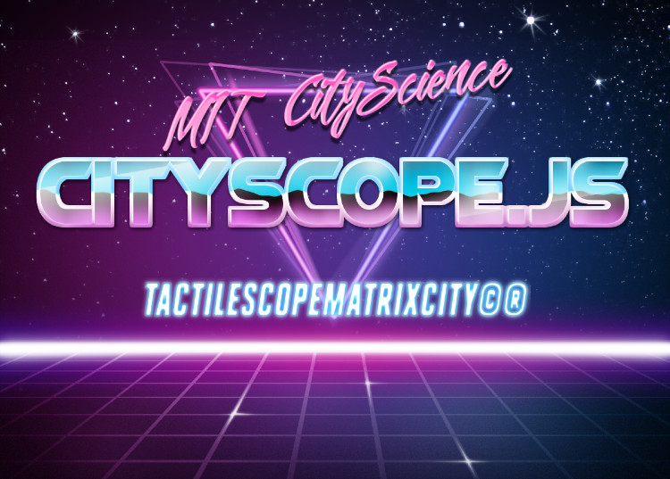

# CityScopeJS

##### also favorably known as ©® TactileScopeMatrixCityLEGOtizer ©®

CityScopeJS is a rapid prototyping urban modeling and simulation platform aimed at making MIT CityScope project accessible though the ubiquity of web-enabled devices. CityScopeJS runs entirely in the browser, including CV, projection and spatial analysis.

#### Before starting

watch this intro video [also, 80's theme music] to get to know how CityScopeJS is making the world a better place:

##### features

- web-based, HTML5 + JS without dependencies
- tested on 100x100 4x4 LEGO table scanning + sending to cityIO @40fps [well, might have *some* lag running it from your phone]
- ~65k potential unique permutations ['brick types'] using only black and white optically tagged objects

##### the real important features

- 80's graphics
- Turing Complete
- Turing Prize Winner

---

#### Running

[Click here to run CityScopeJS](https://cityscope.github.io/CS_citysc…)
It should run from any modern browser with HTML5 support. Tested on Raspberry pi 2, Android and IPhone Yes, IE7 on Windows XP might not work.

#### Setup

Table and LEGO bricks settings are under `data` folder in `json` format. This could be brought into GUI at later stage.
To create or test binary permutations, us this: `/Py_BinaryPermutations/py_bin.py`

---

#### the true story behind CityScopeJS

CityScopeJS, also favorably known as _©® TactileScopeMatrixCityLEGOtizer ©®_ was invented during a warm, steamy but somehow cold summer night in December, 2013. My friend [Hackerman](https://www.youtube.com/watch?v=KEkrWRHCDQU) and I were riding [Jeremiah](https://www.youtube.com/watch?v=GBlWkNZph0s), our old faithful Trojan horse, across the Mohave dessert.

Since we were both holding on to Jeremiah's saddle, Hackerman was only able to write the code in 0.5 [parsecs](https://en.wikipedia.org/wiki/Parsec "Title"), using his [Nintendo PowerGlove](https://en.wikipedia.org/wiki/Power_Glove); After 6 hours of code-riding, CityScopeJS was developed, tested, QAed by NASA and SpaceX and was ready to [disrupt and make the world a better place.](https://www.youtube.com/watch?v=J-GVd_HLlps)

The system has since won the Oscars, Turing Prize, 47 pending patents, a book and was featured in nine Bollywood films.

---

using @jlouthan matrix transformations.

[contributors](https://github.com/CityScope/CS_cityscopeJS/graphs/contributors)
